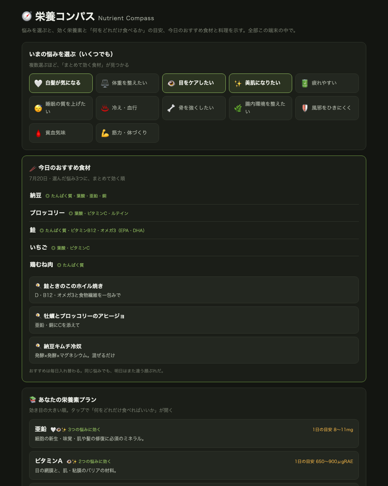

# 栄養コンパス — Nutrient Compass

A local-first nutrition compass: select your wellness concerns (multiple at
once), and it shows which nutrients help, how much of which foods to eat, and
today's recommended ingredients and dishes — rotating daily.

悩みを選ぶと「効く栄養素」「何をどれだけ食べるか」「今日のおすすめ食材と料理」を
示す羅針盤。悩みは複数選べて、**選ぶほど「まとめて効く食材」が見つかる**のが特徴です。

## How it works — no AI API, by design

The relationships between concerns, nutrients, and foods are stable knowledge.
This app encodes them as data (12 concerns, 23 nutrients with daily targets,
food portions, 16 dishes) and uses a transparent scoring engine:

1. Each selected concern weights its key nutrients
2. Foods are scored by how many of *your* weighted nutrients they cover —
   multi-concern selections surface "one dish, many benefits" ingredients
3. A date-seeded rotation keeps daily picks fresh without randomness on reload

Zero API calls, zero running cost, works offline. Shareable presets via URL,
e.g. `?goals=gray,skin,eyes`.

## Disclaimer

This app provides general food and nutrition information, not medical advice.
Daily targets are approximations based on public dietary reference intakes for
Japan. Consult a physician or registered dietitian for medical conditions,
medication interactions, or pregnancy.

## Privacy and storage

Selections live only in this browser's `localStorage`. No backend, accounts,
analytics, or tracking. The app makes no network requests.

## Development notes

Built at Yuriqa Lab with AI pair-programming assistance for implementation.
The nutrition content model and food selections draw on the author's training
as a licensed chef and certified confectionery hygienist; product decisions
are human.

## Development

No build step. Open `index.html` in a browser.

## License

[MIT](./LICENSE) © Yuriqa Lab
